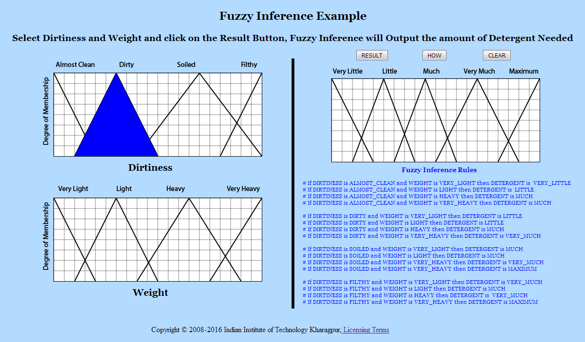
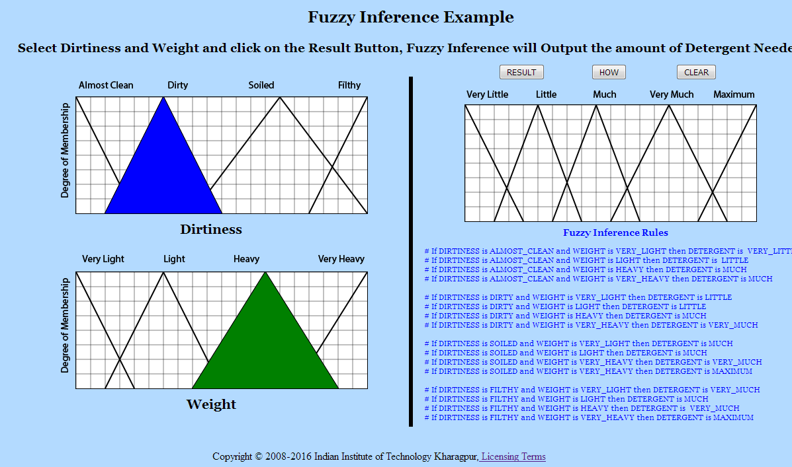
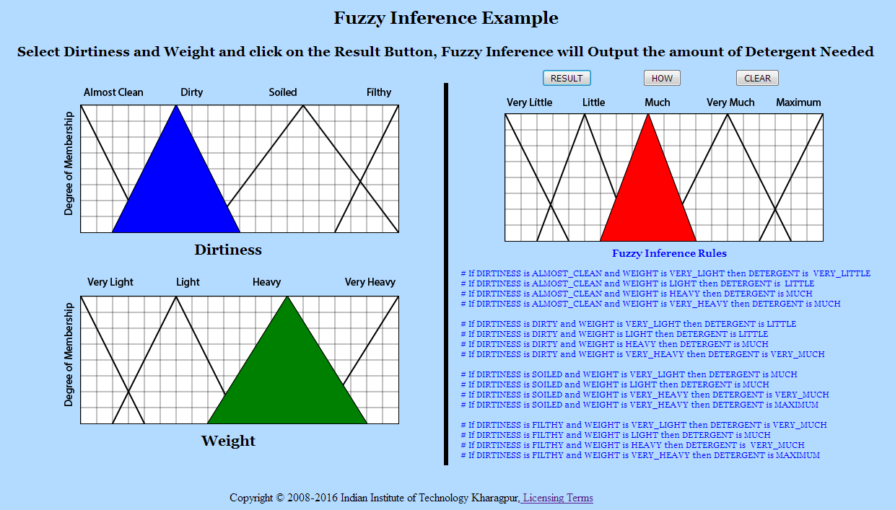
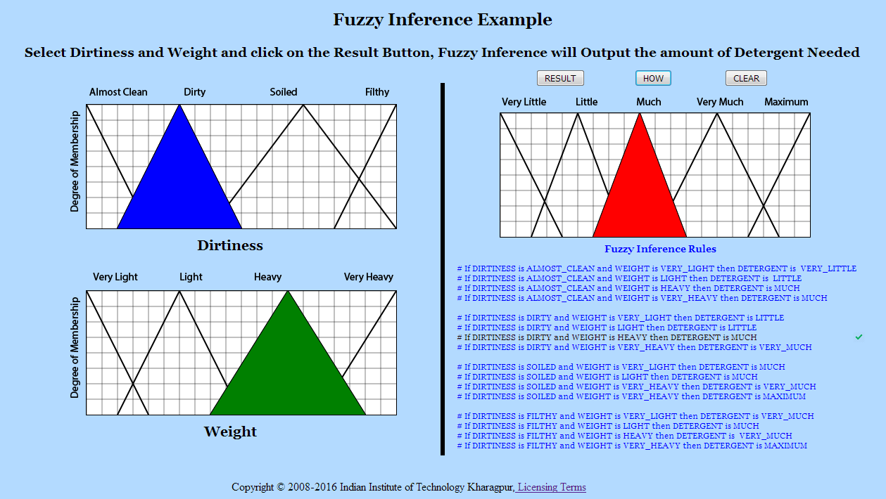
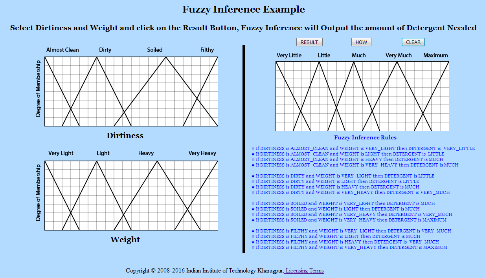

# Procedure

1. Click on any function of the Dirtiness section to select the level of Dirtiness.

   

   
   

2. Click on any function of the Weight section to select the Weight.

    

   
   

3. After selecting Dirtiness and Weight click on the Result button to get the amount of Detergent needed.

    

   
   

4. Click on How? Button to know which inference rule was used to arrive at the Conclusion.

    

   
   

5. Click on Clear Button and Perform the experiment again.

    

   
   

